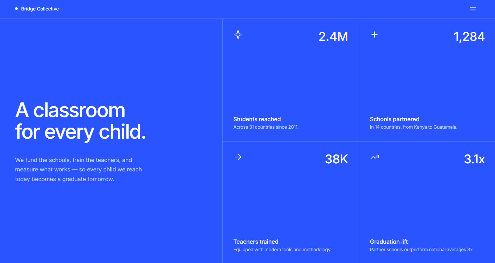

# Frontend Mentor - Grid landing page solution

This is a solution to the [Grid landing page challenge on Frontend Mentor](https://frontendmentor.io). Frontend Mentor challenges help you improve your coding skills by building realistic projects.

## Table of contents
- [Overview](#overview)
  - [The challenge](#the-challenge)
  - [Screenshot](#screenshot)
  - [Links](#links)
- [My process](#my-process)
  - [Built with](#built-with)
  - [What I learned & Key Challenges](#what-i-learned--key-challenges)
  - [Project Estimation & Retrospective](#project-estimation--retrospective)
- [Author](#author)

## Overview

### The challenge
Users should be able to:
- View the optimal layout depending on their device's screen size (Desktop 1440px, Tablet 768px, and Mobile 320px).
- See interactive hover and focus-visible keyboard navigation states for all stat cards and navigation links.
- Experience an advanced architectural layout that transforms a fluid single-column responsive flow into a complex multi-dimensional CSS Grid framework.
- Animate the slide-in mobile navigation overlay panel cleanly from the right screen boundary while enforcing strict focus containment rules.
- Dynamically parse asynchronous statistics data variables securely out of an isolated external data structure file.

### Screenshot
  
*Fig 1. Final look of my responsive Grid landing page component using hybrid CSS Grid layouts, full semantic focus trap orchestration, and fluid SCSS container architecture.*

### Links
- Solution URL: [Solution Link](https://github.com/Osty-trainee/Grid-landing-page)
- Live Site URL: [Live Site Link](https://osty-trainee.github.io/Grid-landing-page/)

## My process

### Built with
- Semantic HTML5 markup (utilizing explicit `<main>` grid wrapper mechanics, independent `<article>` statistics entries, and accessible `<nav>` landmark tags for assistive technology layout maps).
- Strict BEM (Block-Element-Modifier) methodology avoiding cascading collisions, encapsulating layout rules directly within compiled SCSS selectors.
- Advanced DOM integration using vanilla asynchronous programming patterns: **Vanilla JavaScript (ES6+)** combined with the **Fetch API** layer to process external database tokens.
- Cross-dimensional layout systems: Native **CSS Grid** column mapping orchestrating the main view boundaries alongside unified sub-component layout scaling rules.
- Modular Sass/SCSS architecture dividing rules into production-ready file blocks (`_fonts`, `_variables`, `_reset`, `_menu`, `_grid-layout`, `main.scss`).
- Clean Git project state management tracking source architecture transformations and synchronized final CSS output builds.

### What I learned & Key Challenges

This project was a massive milestone for me as it marked my **first real-world experience working with JavaScript logic, parsing local JSON data structures, and implementing advanced semantic `<nav>` layout overlay mechanics.** The layout constraints presented challenges on every layer:

1. **The Asymmetric Desktop Alignment & Grid Axis Collapse:**
   On large displays (`1100px+`), the design divides the viewport into an asymmetrical layout split (45% Hero vs 55% Stats grid). Initially, using a standard nested grid approach caused the horizontal divider lines within the `.stats` card row to completely desynchronize from the `.hero` container height bounds, causing skewed lines on resolutions like 1280x800. I resolved this by flattening the grid hierarchy. By setting `display: contents;` on the intermediate `.stats` wrapper, I allowed individual `.stat-card` elements to bind directly to a unified global `.main` grid container:
   ```scss
   @media (min-width: 1100px) {
       .main {
           display: grid;
           grid-template-columns: 45fr 27.5fr 27.5fr; /* Combines hero and stat card columns on one shared axis */
           grid-template-rows: 1fr 1fr; /* Establishes a synchronized horizontal baseline across the entire screen */
       }
       .stats {
           display: contents; /* Safely hoists children elements directly into the parent grid stream */
       }
   }
   ```

2. **The Overlay Z-Index & Layout Shifting Bug:**
   When activating the mobile/tablet navigation sidebar panel, the block failed to cleanly overlay the underlying `.hero` container text nodes. Furthermore, viewport scrolling on mobile viewports caused an unstable layout jitter that revealed a distorted background layer behind the bar. I resolved this by transitioning the panel to a fixed positioning framework coupled with hardware-accelerated transform rules, while safely locking down the background document thread:
   ```scss
   .menu-panel {
       position: fixed;
       top: 3.75rem; /* Anchors the drop-down panel directly below the sticky navigation banner */
       right: 0;
       width: 55vw; /* Perfectly captures the responsive desktop alignment column grid width */
       height: calc(100vh - 3.75rem);
       transform: translateX(100%); /* Keeps the layout safely hidden offscreen until toggle invocation */
       transition: transform 0.3s ease;
       z-index: 95;
   }
   ```

3. **Asynchronous State Target Mismatch (The JSON Parsing Obstacle):**
   Writing my first `fetch()` script to transition stat numbers dynamically from zero presented parsing matching bugs. The script initially threw target reference exceptions because of an invisible whitespace mismatch between the raw HTML inner text nodes and the target strings in `data.json`. I solved this by adding rigorous string sanitization using the `.trim()` API during structural lookup loops:
   ```javascript
   if (labelElement && labelElement.textContent.trim() === stat.label.trim()) {
       const numberElement = card.querySelector('.stat-card__number');
       if (numberElement) {
           animateValue(numberElement, 0, stat.value, 1500, stat.isFloat, stat.suffix);
       }
   }
   ```

4. **The Menu Keyboard Trap Barrier (Accessibility Compliance):**
   An essential criterion for this challenge was keeping keyboard navigation trapped inside the open sidebar menu panel. Without manual interception, tab keys would continue cycling through hidden elements underneath the overlay. I achieved proper accessibility compliance by writing a focused JavaScript key event handler that watches bounding tab positions and cycles focus back to the menu start:
   ```javascript
   function trapFocus(e) {
       if (e.key !== 'Tab') return;
       const focusableElements = menuPanel.querySelectorAll('a[href], button:not([disabled])');
       const firstEl = focusableElements[0];
       const lastEl = focusableElements[focusableElements.length - 1];

       if (e.shiftKey && document.activeElement === firstEl) {
           lastEl.focus();
           e.preventDefault();
       } else if (!e.shiftKey && document.activeElement === lastEl) {
           firstEl.focus();
           e.preventDefault();
       }
   }
   ```

## Project Estimation & Retrospective
- **Initial Estimation:** 4 to 5 hours.
- **Actual Time Taken:** ~ 7 hours (including structural asynchronous JSON debugging, strict screen-reader focus trap scripting, and layout lines calibration).

**Retrospective Summary:**  
While building grid containers seems simple on paper, linking layout logic with real async JavaScript data streams requires careful coordination. Overcoming problems with layout lines and menu layers taught me how crucial it is to use modern tools like `display: contents;` and explicit system overrides like `prefers-reduced-motion` to build fast, sturdy, and highly accessible web projects.

## Author

- GitHub - [@Osty-trainee](https://github.com/Osty-trainee)
- Frontend Mentor - [@Osty-trainee](https://www.frontendmentor.io/profile/Osty-trainee)
